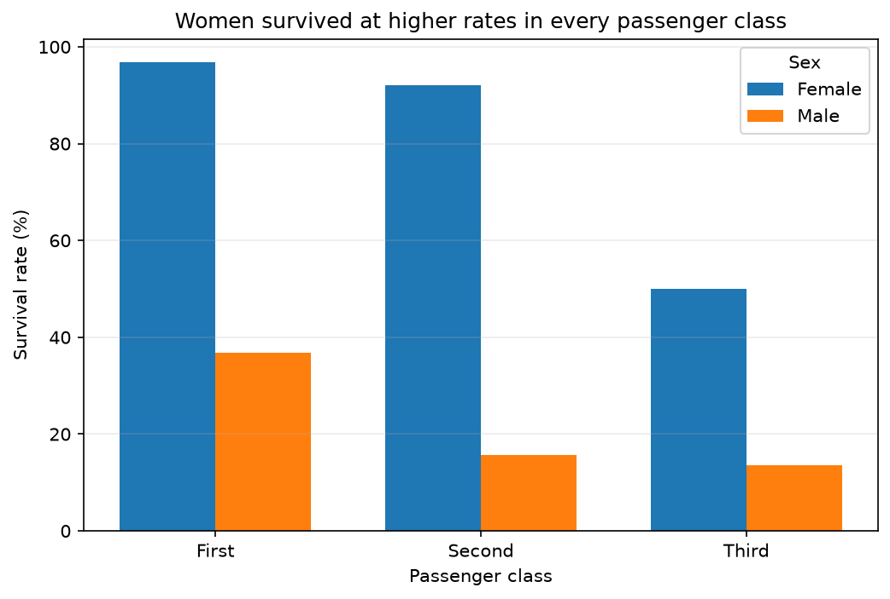
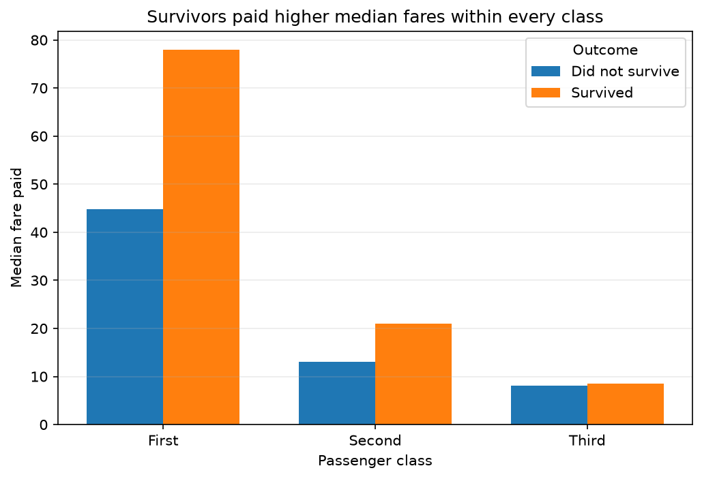

# Titanic Data Wrangling and Exploratory Analysis

## Question explored

This analysis investigated how passenger sex and class were associated with
survival aboard the Titanic. I also examined whether survivors and
non-survivors paid different median fares within each passenger class.

The dataset contains 891 passengers and 15 original columns. It includes
numeric variables such as age and fare, and categorical variables such as
sex, passenger class, deck, and embarkation town.

## Data cleaning

The original dataset had 177 missing age values, 688 missing deck values,
and two missing values in both `embarked` and `embark_town`.

I filled missing ages using the median age for passengers with the same sex
and passenger class. I chose this method because age distributions may be
different across sex and class groups, making it more suitable than using
one overall median.

The missing embarkation values were replaced with the most common value in
their respective columns. This was reasonable because only two records were
missing these values.

I replaced missing deck values with `Unknown`. I did not remove these rows
because doing so would have removed 688 of the 891 records and greatly
reduced the dataset.

The dataset originally had 107 exact duplicate-looking rows. After filling
missing values, 113 rows appeared identical because some previously
different missing values were replaced with the same values. I retained
these records because the dataset does not contain a passenger identifier.
Different passengers may have had identical recorded characteristics.

After cleaning, the dataset still contained 891 rows and had no remaining
missing values.

## Feature engineering

I grouped passengers by sex and class and calculated four statistics for
each group:

- survival rate;
- mean fare;
- median age;
- passenger count.

I merged these statistics back into the main dataframe. This increased the
number of columns from 15 to 19 while keeping all 891 passenger records.

I also reshaped the group statistics into a pivot table so that male and
female survival rates could be compared across passenger classes.

For the NumPy computation, I extracted the fare column into a NumPy array.
Because fares were highly skewed, I applied a logarithmic transformation
before calculating standardized scores. The resulting scores had a mean
close to 0 and a standard deviation close to 1. Their values ranged from
approximately -3.06 to 3.39.

## Findings

Passenger sex had a strong association with survival in all three classes.
First-class women had the highest survival rate at approximately 96.8%,
compared with 36.9% for first-class men.

In second class, approximately 92.1% of women survived, compared with only
15.7% of men. Third-class passengers had lower survival rates overall, but
women still survived at a much higher rate than men: 50.0% compared with
approximately 13.5%.

The first chart shows that the difference between male and female survival
was visible in every passenger class. It also shows that survival generally
declined as passenger class moved from First to Third.

Survivors also paid higher median fares within each passenger class.
In first class, survivors paid a median fare of approximately 77.96,
compared with 44.75 for passengers who did not survive. In second class,
the median fares were 21.00 for survivors and 13.00 for non-survivors.
The difference was much smaller in third class, where the medians were
approximately 8.52 and 8.05.

This finding does not necessarily mean that paying a higher fare directly
increased a passenger's chances of survival. Fare may represent other
factors, such as cabin location, ticket type, family travel, or access to
parts of the ship.

## Reflection

The groupby and merge transformation took me the longest to understand.
The groupby operation reduced the passenger-level data into six sex-and-class
groups. I then had to understand how merging could return those statistics
to all 891 passenger records without changing the number of rows. The
`validate="many_to_one"` argument also helped me understand that many
passengers were being matched to one summary row for their group.

If I used another dataset, I would choose one with a unique identifier for
every observation. This would make duplicate handling more reliable. I
would also inspect the amount of missing data before selecting the dataset,
because the large number of missing deck values limited the questions I
could investigate.